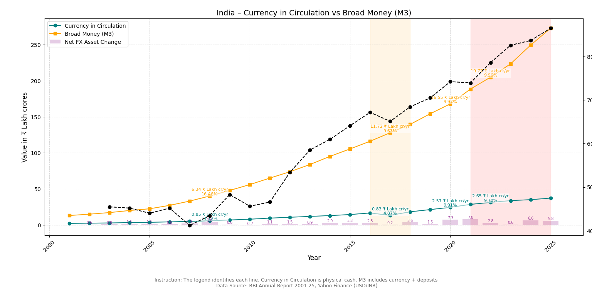

<h1 align="center">💹 <b>RBI Liquidity Analysis</b> & 🇮🇳💵 <b>USD/INR Overlay</b></h1>
<p align="center"><i>Visualizing Money Supply, FX Assets & Exchange Rate Trends (2000–2025)</i></p>

A reproducible, data-driven analysis of India’s monetary liquidity and external cushion from 2000–2025.  
This project visualizes **Currency in Circulation (CiC)**, **Broad Money (M3)**, **Net Foreign Exchange (FX) Assets**, and overlays **USD/INR** to interrogate when and why the rupee weakens.

---

## 📌 Introduction

The project began with a simple observation: **CiC grew more than threefold after 2017**.  
To avoid a one-dimensional view of liquidity, we added **M3** (to capture deposits) and **Net FX Assets** (RBI + commercial banks), then overlaid **USD/INR**.  
The result is a multi-layer macro dashboard connecting domestic liquidity composition to the rupee’s behavior.

**Goal:** Turn descriptive plots into an analytical tool that reveals the timing and mechanisms behind rupee moves.  
**Core lens:** Compare domestic liquidity growth (CiC, M3, and the gap `M3 − CiC`) against changes in Net FX Assets and market outcomes (USD/INR).

---

## 📊 Data Sources

- **RBI Monetary Aggregates:** Annual CiC and M3, 2000–2025.
- **Net FX Assets:**
  - Central bank: *Net Foreign Exchange Assets of the Central Bank*
  - Commercial banks: *Net Foreign Assets of Commercial Banks*
  - Combined and differenced to obtain annual change.
- **USD/INR:** Annual average or year-end rate.

> All monetary values expressed in ₹ Lakh crores.

---

## ⚙️ Methodology

1. **Series Preparation**
   - Resample to annual frequency.
   - Normalize units to ₹ Lakh crores.
   - Compute `fx_change` as YoY difference of combined FX assets.

2. **Key Constructs**
   - **Liquidity gap (bank money):**  
     `Gap = M3 − CiC` → approximates deposits and other non-cash components.
   - **Ratios (optional):**  
     `FX / M3` and `FX / CiC` → falling ratios signal external cushion not keeping pace.

3. **Correlation Snapshot**
   - Compute `pct_change` for M3, FX Assets, and USD/INR.
   - Build correlation matrix to test co-movements.
   - Weak full-period correlations → regime-specific dynamics dominate.

---

## 📈 Chart Layers

- **CiC line:** Physical notes/coins held by the public.
- **M3 line:** CiC + deposits + other liquid liabilities.
- **Net FX Asset change bars:** Annual change in combined RBI + commercial bank FX assets.
- **USD/INR (secondary y-axis):** Market outcome.

**Styling:**
```python
ax1.bar(fx_change.index, fx_change.values, color='purple', alpha=0.3, label='Net FX Asset Change')
ax1.legend(loc="upper left", fontsize=10)
```
---

## 🔍Key Insights

- Deposits expanding faster than cash:
Post‑2017, the gap (M3 − CiC) widens sharply → structural shift toward banked liquidity.
- Healthy in isolation, but in this dataset FX reserves growth lagged.
- FX cushion mismatch:
M3 growth outpaced Net FX Asset change by large margins in multiple years.
- Domestic liquidity expansion not proportionately backed by external assets → potential currency pressure.
- Regime-driven vulnerability:
Depreciation phases (USD/INR upswings) align with weak FX cushion during strong domestic liquidity growth.
- Patel era fingerprint:
CiC growth rate tripled post‑2017, deposits grew even faster → broad-based liquidity push.
- Spread in M3 vs CIC:
  The widening spread of CIC vs M3 without the Fx assets cushion reveals that the bank have more money in there system to inject in the market for
  circulation thus explaining the 50% Growth in NBFC's registered with RBI in the last 8 years.
---

## 🧠 Hypothesis Validation

The Reserve Bank of India (RBI) has been injecting liquidity into the economy without proportionate backing in net foreign exchange assets or other reserves, contributing to sustained inflationary pressures and depreciation of the Indian rupee against the US dollar.
### 📊 Evidence from Data

- **Divergence Between Currency/M3 and FX Assets**
  - **Currency in Circulation** and **Broad Money (M3)** show **steep post‑2014 growth slopes** and **high CAGR values**.
  - *Net FX Assets* (RBI + commercial banks) have **not grown at a comparable pace**, with several years showing **negligible or negative change**.

- **Policy Windows & Liquidity Surges**
  - **Urjit Patel era (2016–2018)** → *Moderated growth* in currency supply, aligning with tighter monetary stance.
  - **Post‑2019**, especially **post‑pandemic (2021–2025)** → Liquidity growth **accelerates sharply**, while FX asset accumulation **lags**.

- **Exchange Rate Correlation**
  - **USD/INR annual averages trend upward** in periods of rapid money supply expansion → *Suggests depreciation linked to excess domestic liquidity*.

---

### 🧠 Interpretation
> When **money supply expands faster than reserve assets**, the domestic currency’s perceived value **weakens**.  
> This imbalance can **fuel inflation** by increasing demand‑side pressures without a matching increase in real economic output or external asset buffers.

---

### 📌 Narrative Context
Critics argue that the RBI’s leadership during certain periods has **aligned closely with prevailing government fiscal priorities**, potentially **compromising independent monetary discipline**.  
This perceived **"puppet" dynamic** raises concerns about the central bank’s ability to act as a **counter‑cyclical stabilizer** rather than a **liquidity facilitator**.

### 📈 Output Visualization



### 🔍 Highlighted Policy & Liquidity Windows

| Period        | Years        | Context / Narrative                                                                 |
|---------------|--------------|-------------------------------------------------------------------------------------|
| **Pre‑2014**  | 2000–2014    | Steady growth before government change; baseline monetary expansion.                |
| **Post‑2014** | 2015–2025    | Accelerated money supply growth; FX asset growth lags behind.                       |
| **Urjit Patel Era** | 2016–2018 | Moderated currency growth under tighter monetary stance.                           |
| **After Patel** | 2019–2025  | Renewed liquidity surge; post‑pandemic expansion especially sharp.                  |

---

### 📊 Additional Observations
- **Net FX Assets** (RBI + commercial banks) show **negligible or negative change** in several years despite rising money supply.
- **USD/INR** annual averages **trend upward** during rapid liquidity expansion → indicative of rupee depreciation.
- Highlighted periods shaded in the chart correspond to **policy shifts** and **liquidity surges**.

---

